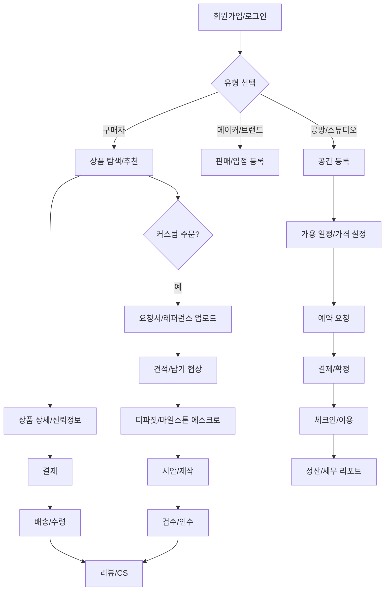
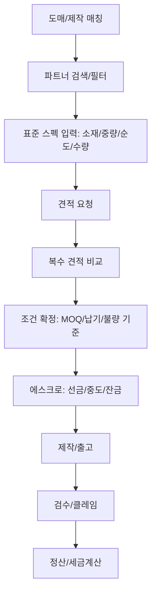
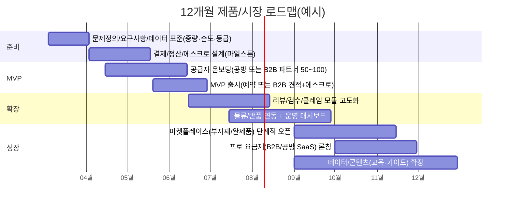

# 웹 기반 주얼리 종합 정보 플랫폼 구축을 위한 딥 리서치 보고서

## Executive summary

본 보고서는 “주얼리 산업의 **정보(지식·시세·가이드) + 거래(완제품·부자재·도매/B2B) + 공간(공방/스튜디오 예약) + 커뮤니티 + 운영도구(정산·물류·마케팅·컴플라이언스)**를 하나의 웹 기반 플랫폼으로 통합”한다는 가정 하에, 국내외 유사 서비스 존재 여부와 경쟁 구도를 조사하고, 경쟁 가능한 제품 요건·기능 우선순위·시장 진입 전략을 제안한다. 1차 시장은 entity["country","대한민국","south korea"]으로 가정한다(사용자 요청에 따른 가정). citeturn8view0turn8view1

핵심 결론은 세 가지다. 첫째, 국내 주얼리 시장은 규모 자체는 크지만(2025년 **약 9.8조 원 추정**) 소비심리·구매율 등 수요 지표는 단기 변동성이 크고, 특히 패션/일반 주얼리 구매율이 역사적 저점으로 언급되는 등(2024년) “B2C만으로는 위험이 큰” 환경이다. citeturn8view0turn8view1 둘째, 국내에는 주얼리 버티컬 커머스(예: K1), 핸드메이드 커머스(예: K2), 공간대여/예약(예: K3), 종로 권역 디렉터리/지도(예: K4), 도매 앱/도매몰(예: K5~K8), 취미 클래스/공방 예약(예: K9), 산업 데이터/리서치 허브(예: K10)가 **각개전투 형태로 존재**하지만, 사용자가 요청한 “종합형”은 사실상 부재에 가깝다. citeturn12search0turn14view0turn15search0turn23view0turn26view0turn22view2turn24view2turn25search15turn19search6turn8view0 셋째, 종합형으로 가려면 “다기능”이 아니라 **신뢰/결제 안전(에스크로·마일스톤), B2B 거래 규칙(중량·순도·등급·MOQ·차등가), 물류/검수, 인증/정품, 법무·세무·고지 체계**가 제품의 중심이 되어야 하며, 특히 국내 도매 앱들이 업계 특성을 충분히 반영하지 못한다는 연구 지적은 ‘신뢰/결제’ 및 ‘B2B 전용 기능’을 MVP급으로 끌어올릴 근거가 된다. citeturn30view2turn20view3turn10view0

이 보고서의 전략적 제안은 “올인원”을 표방하되, 12개월 내에는 **단일 웨지(wedge)**로 네트워크 효과를 만들고, 이후 단계적으로 B2C/B2B를 확장하는 것이다. 구체적으로는 (1) ‘공방·스튜디오 예약 + 커뮤니티/교육 + 부자재 마켓’(취미/메이커 중심) 또는 (2) ‘도매/제작 매칭 + 견적/마일스톤 결제 + 검수/정산’(인디 디자이너/소형 브랜드 중심) 중 하나를 우선 웨지로 선택하고, 나머지 모듈을 로드맵으로 붙이는 접근이 성공 확률이 높다(분석/제안).

## 시장 맥락과 수요 신호

국내 주얼리 시장 규모에 대해, 산업 리서치 허브(K10)는 소비자 조사 기반 추정치를 매년 공표하고 있으며(전문 리서치 기관 entity["organization","한국갤럽","research firm kr"]과 공동 수행 언급), 2025년 시장 규모를 **약 9조 7,744억 원**으로 제시한다. citeturn8view0 같은 출처에서 2025년 세부 구분으로 “국산 주얼리(국내 제조) 약 6.0조 원(-1.1% YoY), 수입 주얼리 약 3.8조 원(+39.2% YoY)” 등 구조가 제시되는데, 이는 ‘국내 제조 기반의 정체’와 ‘수입/브랜드 유통의 성장’이 동시에 관찰된다는 뜻이다. citeturn8view0 플랫폼 관점에서는 B2C 판매만으로는 국내 제조 생태계의 성장을 곧바로 담보하기 어렵고, **유통·브랜딩·해외판로** 또는 **공급망 효율화(B2B)**를 함께 설계해야 한다는 시사점이 생긴다(분석/제안).

수요 측 단기 지표는 엇갈린다. 2024년 수출입 동향을 다룬 산업 리포트 뉴스에서는 “2024년 패션주얼리 구매율 13.4%, 일반주얼리 구매율 13.1%가 역대 최저”로 언급되며, 국내 시장이 침체를 벗어나지 못하고 있다는 평가가 함께 제시된다. citeturn8view1 또한 이 리포트는 저가 해외 플랫폼(entity["company","AliExpress","cross-border marketplace"], entity["company","Temu","cross-border marketplace"])을 통한 비브랜드형 수입 증가 경향을 지적해, “저가·대량 유통”과의 경쟁이 심화되고 있음을 시사한다. citeturn8view1 이 환경에서는 ‘정품/품질/제작 스토리/맞춤’ 같은 비가격 가치가 있는 카테고리(핸드메이드·커스텀·로컬 브랜드)에 플랫폼이 강점을 가져야 한다(분석/제안).

반면, 인접 시장의 강한 수요 신호도 존재한다. K2는 월간 활성·누적 거래액 등에서 큰 규모의 트래픽/거래를 보여주며(예: “누적 거래액 1조+”, “누적 다운로드 2,000만+”, “월 방문자 200만+” 등), ‘선물·스토리·팬덤형 커머스’와 결합된 메이커 생태계가 이미 국내에서 작동하고 있음을 보여준다. citeturn14view0turn14view3turn13search11 K3는 공간대여 시장에서 “누적 회원 200만, 호스트 8만, 등록 공간 12만, 누적 예약 약 1,000만”을 제시하며, 취미/연습/촬영/원데이클래스 중심의 ‘예약+결제’ 경험이 대중화됐음을 보여준다. citeturn15search0turn15search4 따라서 주얼리 종합 플랫폼의 초기 수요를 “완제품 구매자”에서만 찾기보다, **메이커(취미/창업)·공방/스튜디오 이용자**까지 포함하는 다면 수요로 설계하는 것이 합리적이다(분석/제안).

타깃 페르소나는 다음 네 그룹이 핵심이다(분석/제안).

| 페르소나 | 핵심 과업 | 가장 큰 마찰 | 플랫폼이 제공해야 할 ‘결정적 가치’ |
|---|---|---|---|
| 취미/DIY 메이커 | 클래스 예약, 부자재 구매, 작품 제작/공유 | 재료·공구·공방 정보가 흩어짐, 후기 신뢰 | 지역/난이도 기반 추천 + 예약/결제 + 재료 번들 + 커뮤니티 |
| 인디 디자이너/소형 브랜드 | 제작처/부자재 소싱, 견적·샘플, 판매 채널 확대 | 종로/도매 네트워크의 비공식성, 거래 신뢰/품질 | 검증된 거래처 디렉터리 + 견적 표준화 + 에스크로/검수 |
| 도매/총판/수입사 | 신상품 노출, 소매점/브랜드 확보, 반복 주문 | 가격/등급/중량 정보 표준 부재, 정산/CS 부담 | 도매 전용 가격체계·MOQ·차등가 + 주문/정산 + 파트너 CRM |
| 공방/스튜디오 운영자 | 공간 대여, 장비/안전 관리, 클래스 운영 | 노쇼/정산/세금, 보험·책임 이슈 | 예약/결제 + 취소정책 자동화 + 보증/보험 옵션 + 운영 대시보드 |

## 국내 경쟁 지형과 유사 서비스

국내는 “주얼리 종합 플랫폼”이라기보다는, 주얼리 생태계의 **조각난 모듈**이 서로 다른 서비스에 분산돼 있다(분석). 예를 들어 K1은 주얼리 버티컬 커머스로서 AI 추천·정기구독 기반, 입점/브랜드 육성 및 물류·OEM/ODM까지 언급되는 ‘엔드투엔드 커머스’ 성격이 강하다. citeturn12search3turn12search0 K2는 ‘작가-팬 커뮤니티형’ 핸드메이드 커머스로, 수수료 인하·무료배송 정책 등으로 셀러 측 가치를 조정하며 생태계를 확장해왔다. citeturn13search0turn14view0turn13search12 K3는 공간대여에서 결제·정산·수수료(게스트 결제금액의 10%를 서비스 수수료로 설명)와 세무 가이드를 제공하는 등, “예약/정산 운영체계”를 이미 고도화했다. citeturn20view3 K4는 종로 권역에서 업체·상가 위치, 검색, 시세(금/다이아) 및 상품 홍보에 초점을 둔 디렉터리/지도형 서비스로, 등록 업체 수(예: 제조 총판 2,200여 업체 등록 언급) 같은 공급자 데이터가 강점이다. citeturn23view0turn23view1

도매/B2B는 앱·도매몰 형태가 다수이나, ‘업계 특화 UX/보안 결제’ 완성도에는 여지가 있다는 지적이 있다. 2025년 연구는 주얼리 도매의 특성으로 (1) 고부가·시각적 특성에 따른 상세 정보, (2) 대량발주·차등가·멤버십 등 B2B 시스템, (3) 중량·순도 등 전문정보 정확성, (4) 신뢰성 있는 거래 환경과 안전한 결제 요구를 제시하면서, 국내 도매 앱들이 이런 업계 고유 특성을 충분히 반영하지 못한다고 지적한다. citeturn30view2 이는 종합 플랫폼이 B2B를 포함할 경우 “상품 등록 UI”보다 먼저 **데이터 표준(중량/순도/등급), 거래 규칙, 결제 안전장치**를 설계해야 한다는 실무적 근거가 된다(분석/제안).

### 국내외 경쟁사·유사 서비스 비교 표

아래 표는 ‘종합형 플랫폼’ 관점에서 경쟁사/유사 서비스를 나열한 것이며, **ID는 기능 매트릭스·URL 인덱스·근접 경쟁 비교표에서 재사용**한다. (URL은 정책상 본문에 직접 표기하지 않고, 뒤의 URL 인덱스 코드블록에서 제공한다.)

| ID | 서비스명 | 권역 | 출시/런칭(확인 가능 범위) | 주요 타깃 | BM(요약) | 강점(요약) | 약점/갭(요약) | 공개된 견인 지표(예시) |
|---|---|---|---|---|---|---|---|---|
| K1 | entity["company","아몬즈","jewelry commerce platform kr"] | KR | 2018년(플랫폼 런칭 언급) citeturn12search0 | 소비자 + 브랜드 | 커머스/브랜드 육성(투자·자체브랜드 언급) citeturn12search0turn12search3 | 주얼리 버티컬, AI 추천·정기구독 언급 citeturn12search0 | 공방/스튜디오 예약·커뮤니티·B2B 디렉터리까지는 제한(공개 정보 기준) | “3,000여 개 주얼리 판매”, 투자 누적 260억 언급 citeturn12search0 |
| K2 | entity["company","아이디어스","handmade marketplace kr"] | KR | 2014년 출시 언급 citeturn8view2 | 소비자 + 메이커 | 거래 수수료, 멤버십/서버이용료 등 citeturn13search12turn14view0 | 대규모 트래픽·작가 생태계, 팬 커뮤니티 기능(팔로우/피드 등) citeturn14view0turn14view3 | 주얼리 ‘전문’ 기능(중량/순도/감정/인증)과 B2B 도매 매칭은 제한 | 누적 거래액 1조+·다운로드 2,000만+·활동 작가 4만+ 등 citeturn14view0turn14view3 |
| K3 | entity["company","스페이스클라우드","space rental platform kr"] | KR | 2016년 시간단위 대여 시작·10주년 언급 citeturn15search0 | 스튜디오/공간 운영자 + 이용자 | 예약 중개 수수료(게스트 결제금액 10% 언급) citeturn20view3 | 예약/정산/세무 가이드까지 운영체계 성숙 citeturn20view3turn15search0 | 주얼리 특화(작업대·장비·안전·보험·자재 연계) 부재 | 누적 회원 200만·호스트 8만·공간 12만·예약 1,000만 등 citeturn15search0turn15search4 |
| K4 | entity["organization","종로주얼리타운 J-MAP","jongno jewelry directory app kr"] | KR | 2016년 웹지도 공개 및 앱 출시 기사 citeturn23view1turn23view0 | 업계 종사자(총판/소매/방문객) | 무료 사용/등록 중심(기사 언급) citeturn23view1 | 업체 위치·리스트·시세·상품홍보 등 디렉터리 강점 citeturn23view0turn23view2 | 결제/정산/물류/검수 같은 ‘거래 인프라’는 약함 | 제조 총판 2,200+ 등록 언급 citeturn23view0 |
| K5 | entity["company","주얼토킹","jewelry wholesale app kr"] | KR | 2023.10 앱 공개(버전 기록) citeturn26view1 | 도매/업계 종사자 | B2B 도매몰(앱 기반) citeturn26view0turn26view1 | 업계 전용 신상품 도매 큐레이션·카테고리 확장(순금/실버/패션 등) citeturn26view0 | ‘안전 결제/신뢰’ 설계 수준은 외부 검증 정보 제한(웹 403) | 앱 다운로드 1천+ citeturn26view0 |
| K6 | entity["company","젬코몰","jewelry b2b app gemco kr"] | KR | (정확한 런칭연도 불명) | 도매/협력업체 | 정보+주문/판매관리 앱 citeturn22view2 | 시세/탄생석/호수계산/생산네트워크/주문·수리·판매관리 등 ‘현장 도구’ 강함 citeturn22view2 | 오픈 마켓형 네트워크 효과는 제한(자사 생태계 중심으로 추정) | 앱 다운로드 100+ citeturn22view2 |
| K7 | entity["company","아트피어스","jewelry wholesale app kr"] | KR | 2021년 업데이트 기록(앱스토어) citeturn24view2 | 도매 회원(사업자 인증) | 도매 회원제 (사업자 인증) citeturn24view2 | “사업자 인증 후 10,000여 개 상품” 등 공급 카탈로그 강점 citeturn25search20 | 커뮤니티/예약/에스크로/검수 등 종합 기능은 부재 | 10,000여 상품(서술) citeturn25search20 |
| K8 | entity["company","다이아민족","diamond wholesale pricing app kr"] | KR | 2021년(앱스토어 ‘새로운 기능’ 시점) citeturn25search15 | 다이아 도매/사업자 | 프리미엄 회원 주문 기능 등(앱 설명) citeturn25search15 | 24시간 도매가 확인·정보 제공(멜리/모노/GIA 등) citeturn25search15 | 범위가 다이아 중심(주얼리 종합이라기보단 ‘전문 정보/거래’) | (공개 사용자/거래 지표 없음) |
| K9 | entity["company","솜씨당","hobby class booking kr"] | KR | 2018년 설립(기업 DB) citeturn19search2 | 취미 수강생 + 공방/강사 | 클래스 중개 + 결제(자체 간편결제 ‘솜씨페이’ 언급) citeturn19search6 | 공방/클래스 검색·일정·수강료 등 예약 UX 강점(보도 설명) citeturn19search14turn19search6 | 주얼리 ‘거래(완제품/도매)’와 품질/인증 영역은 범위 밖 | 누적 다운로드 70만·작가 1만·클래스 2.3만(2021 보도) citeturn19search6 |
| K10 | entity["organization","월곡주얼리산업연구소","jewelry research hub kr"] | KR | (플랫폼 런칭연도 불명) | 업계 종사자/정책/연구 | 리서치/데이터/리포트 허브 citeturn8view0turn8view1 | “국내 유일 주얼리 산업 연구소” 표방, 시장 규모/수출입 동향 등 고신뢰 데이터 제공 citeturn8view0turn8view1 | 거래·예약·커뮤니티 등 트랜잭션 기능은 제한 | 2025년 시장 9.8조 추정치 등(데이터 제공) citeturn8view0 |
| G1 | entity["company","Etsy","handmade marketplace us"] | Global | (표 내부 ‘불명’ 처리) | 소비자 + 메이커 | 리스팅/거래 수수료 + 결제 처리 수수료 + 광고·배송라벨 citeturn10view0 | 거대한 글로벌 네트워크 + 맞춤/주문제작 강점(커스텀 GMS 약 30% 언급) citeturn9view0 | 주얼리 특화 인증/감정의 표준 제공은 제한 | 2025년 활성 구매자 8,650만·활성 판매자 560만·Etsy 마켓 GMS 105억 달러 citeturn9view0 |
| G2 | entity["company","아마존 핸드메이드","handmade program amazon"] | Global | 2015년 런칭 citeturn18search14turn18search2 | 소비자 + 메이커 | 월정액(프로 셀러비) 면제 + 판매 시 15% 리퍼럴 수수료 citeturn18search1turn18search0 | 아마존 트래픽/물류 인프라, 메이커 심사 프로세스 citeturn18search7turn18search1 | 커뮤니티/브랜딩 경험은 플랫폼 성격상 약할 수 있음(일반 비교 논점) | “100명+ 메이커가 연 100만 달러 매출” 사례 언급 citeturn18search2 |
| G3 | entity["company","Peerspace","hourly space rental us"] | Global | 2014년 설립(보도자료) citeturn27search12 | 공간 운영자 + 촬영/모임 이용자 | 호스트 수수료 20% (지원문서) citeturn27search0 | 시간 단위 공간대여의 글로벌 레퍼런스, 보험/안전 관련 리소스 제공(별도 페이지) citeturn27search4turn27search8 | 주얼리 전문(장비·안전·공정) 기능은 없음 | “40,000+ spaces” 보도자료 내 반복 언급 citeturn27search12turn27search20 |
| G4 | entity["organization","Ganoksin","jewelry making community"] | Global | 1995년 설립(사이트 소개) citeturn3search0 | 메이커/교육 | 콘텐츠/포럼 중심 | 주얼리 제작 커뮤니티·교육 아카이브 레퍼런스 citeturn3search0 | 거래/결제/물류 기능은 없음 | (공개 사용자 지표 없음) |
| G5 | entity["company","JOOR","b2b wholesale platform us"] | Global | 2010년 설립(외부 보도) citeturn17search10 | 브랜드 + 리테일 바이어(B2B) | 구독형 플랜(수수료 미부과 정책 명시) citeturn17search22turn17search2 | B2B 주문·쇼룸·결제(embedded payment) 등 도매 운영 표준화 citeturn17search2turn7search15 | 주얼리 ‘중량/순도/감정’ 같은 업계 특수성은 범용 플랫폼 한계 | 14,000+ 브랜드·600,000+ 바이어(홈페이지 카피) citeturn17search2 |
| G6 | entity["company","Nivoda","b2b diamond marketplace uk"] | Global | 2017년 inception 언급 citeturn17search5turn17search25 | 주얼러/리테일러/공급자 | B2B 마켓 + API/피드 제공(홈페이지) citeturn17search1 | 다이아·보석 소싱의 디지털화(재고·주문 자동화) citeturn17search1turn17search5 | 주얼리 완제품/공방 예약 등은 범위 밖 | “1.5M+ diamonds” 보도 언급 citeturn17search5 |
| G7 | entity["company","IDEX Online","diamond trading platform be"] | Global | 2000년 설립/플랫폼 성격 소개 citeturn17search4turn17search12 | 다이아 딜러/주얼러(B2B) | 거래 플랫폼 + 시세/뉴스 | “700,000+ diamonds listed”, ‘secure’ 강조 citeturn17search4 | 범위가 다이아 중심, 소비자 커머스/공방은 없음 | (공개 사용자/거래 지표 제한) |
| G8 | entity["company","Jewelxy","jewelry marketplace india"] | Global | 2017-04-07 런칭 언급 citeturn16search3 | B2B+B2C+O2O | “commission free” 표방 citeturn16search3 | 인더스트리 특화(인도 주얼리 산업 전용)·수수료 차별화 citeturn16search3 | 국내 시장(1차 목표)과는 공급망/규제 차이 | “10 lac+ businesses” 도달 주장(블로그) citeturn16search3 |
| G9 | entity["company","GemRockAuctions","gemstone auction platform au"] | Global | 2004년부터 서비스 언급 citeturn3search1 | 보석/원석 구매자 + 판매자 | 경매/마켓 수수료형(일반) | 원석/보석 거래 특화 | 주얼리 완제품/공방·제작 매칭은 제한 | (공개 GMV/사용자 지표 제한) |
| G10 | entity["company","1stDibs","luxury marketplace us"] | Global | 2000년 창업(일반 정보) citeturn3search5 | 고가 소비자 + 딜러 | 구독+커미션(공시 기반 범주) citeturn29search26 | 럭셔리/큐레이션·신뢰(검증된 셀러 모델) | 수수료/구독 부담이 셀러 진입장벽 가능(모델 특성) | 2024년 Q4 Active Buyers 약 64K 등(보도) citeturn29search8 |
| G11 | entity["company","Ruby Lane","vintage marketplace us"] | Global | (표 내부 ‘불명’ 처리) | 빈티지/앤틱 구매자+셀러 | 월 유지비 + 판매 수수료(FAQ) citeturn28search2 | 빈티지/앤틱 특화, 비용 구조가 단순 citeturn28search2 | 주얼리 제작/공방/도매 기능 없음 | 월 최소 $45(FAQ) citeturn28search2 |
| G12 | entity["company","CustomMade","custom jewelry platform us"] | Global | 커스텀 주얼리 프로세스(디자인 디파짓) citeturn28search5 | 커스텀 주얼리 수요자 | 상담→디파짓→3D 렌더링→제작 프로세스 citeturn28search5 | 커스텀 워크플로 강함(표준 프로세스) citeturn28search5 | 마켓플레이스(다수 셀러 네트워크) 모델과는 다름 | (공개 사용자/GMV 지표 제한) |

### URL 인덱스 (복사/참조용)

```text
K1: https://www.amondz.com/
K2: https://www.idus.com/
K3: https://www.spacecloud.kr/
K4: (접속 불안정/변동 가능) https://jmap.unifor.kr/m/
K5: https://m.jeweltalking.com/
K6: https://play.google.com/store/apps/details?id=igemco.com.GemcoMall
K7: https://apps.apple.com/kr/app/%EC%95%84%ED%8A%B8%ED%94%BC%EC%96%B4%EC%8A%A4/id1549497936
K8: https://apps.apple.com/kr/app/%EB%8B%A4%EC%9D%B4%EC%95%84%EB%AF%BC%EC%A1%B1/id1528295331
K9: https://www.sssd.co.kr/
K10: https://w-jewel.or.kr/

G1: https://www.etsy.com/
G2: https://sell.amazon.com/programs/handmade
G3: https://www.peerspace.com/
G4: https://www.ganoksin.com/
G5: https://www.joor.com/
G6: https://nivoda.com/
G7: https://www.idexonline.com/
G8: https://www.jewelxy.com/
G9: https://www.gemrockauctions.com/
G10: https://www.1stdibs.com/
G11: https://www.rubylane.com/
G12: https://www.custommade.com/custom-jewelry/
```

### 기능 매트릭스

기능 매트릭스는 사용자가 요청한 “핵심 기능 묶음”을 기준으로 ✓/△/✕로 표시했다. 표기는 공개된 기능 설명과 정책/보도 자료를 근거로 하며, 확인이 어려운 영역은 △(부분/불명확)로 두었다. citeturn12search0turn14view0turn20view3turn23view0turn26view0turn22view2turn25search15turn19search6turn10view0turn27search0turn18search1turn17search2turn17search1turn17search4turn28search5

| ID | 공방/스튜디오 공유 | 완제품 마켓 | 부자재 마켓 | 리테일/도매/파트너/스튜디오 디렉터리 | 커뮤니티/포럼 | 예약/스케줄 | 결제/에스크로 | 물류/풀필먼트 | 리뷰/평점 | 검증/품질관리 | 법무/컴플라이언스 | B2B 기능 |
|---|---|---|---|---|---|---|---|---|---|---|---|---|
| K1 | ✕ | ✓ | △ | △ | △ | ✕ | △ | △(풀필먼트 언급) | △ | △ | ✕ | △(OEM/ODM 언급) |
| K2 | ✕ | ✓ | △(공급 카테고리 존재 가능) | △ | ✓(팔로우/피드 등) | ✕ | ✓(구매안전서비스 언급) | △(택배/정산 지원) | ✓ | △ | △(인증/고지) | △ |
| K3 | ✓ | ✕ | ✕ | ✓(공간 카테고리) | △(매거진/콘텐츠) | ✓ | ✓ | ✕ | ✓(후기 모델 일반) | △ | △(정산·세무 안내) | ✕ |
| K4 | ✕ | △(홍보 중심) | ✕ | ✓ | ✕ | ✕ | ✕ | ✕ | ✕ | △(등록 기반) | ✕ | △(업계 정보) |
| K5 | ✕ | △(도매몰) | △ | △ | ✕ | ✕ | △ | △ | △ | △ | ✕ | ✓ |
| K6 | ✕ | △ | ✕ | △ | ✕ | ✕ | ✕ | ✕ | ✕ | △ | ✕ | ✓(주문/판매관리) |
| K7 | ✕ | △ | △ | ✕ | ✕ | ✕ | △ | △ | △ | △ | ✕ | ✓(도매 회원제) |
| K8 | ✕ | ✕ | ✕ | ✕ | ✕ | ✕ | △(프리미엄 주문) | ✕ | ✕ | ✓(감정/등급 정보) | ✕ | ✓(도매가/주문) |
| K9 | ✓(공방/클래스) | ✕ | △(키트/준비물) | ✓(공방 정보) | △ | ✓ | ✓ | ✕ | ✓ | △ | ✕ | ✕ |
| K10 | ✕ | ✕ | ✕ | ✓(산업 정보) | ✕ | ✕ | ✕ | ✕ | ✕ | ✓(리서치) | △ | ✕ |
| G1 | ✕ | ✓ | ✓(craft supplies) | △ | △ | ✕ | ✓ | △(배송라벨) | ✓ | △ | △ | △ |
| G2 | ✕ | ✓ | △ | ✕ | ✕ | ✕ | ✓ | △(아마존 물류 옵션) | ✓ | ✓(신청/심사) | △ | △ |
| G3 | ✓ | ✕ | ✕ | ✓ | △ | ✓ | ✓ | ✕ | ✓ | △ | △(보험/약관) | ✕ |
| G4 | ✕ | ✕ | ✕ | ✕ | ✓ | ✕ | ✕ | ✕ | △ | △ | ✕ | ✕ |
| G5 | ✕ | ✕ | ✕ | ✓(네트워크) | ✕ | △(트레이드쇼) | ✓(B2B 결제) | △(연동/통합) | △ | △ | △ | ✓ |
| G6 | ✕ | ✕ | ✕ | ✕ | ✕ | ✕ | ✓(거래 인프라) | ✓(소싱/주문) | ✕ | ✓(품질/등급) | △ | ✓ |
| G7 | ✕ | ✕ | ✕ | ✕ | ✕ | ✕ | ✓(거래 플랫폼) | ✕ | ✕ | ✓(secure 강조) | △ | ✓ |
| G8 | ✕ | ✓ | ✓ | ✓ | △ | ✕ | △ | △ | △ | △ | △ | ✓ |
| G9 | ✕ | ✕ | △(원석) | ✕ | △ | ✕ | ✓ | △ | ✓ | △ | △ | △ |
| G10 | ✕ | ✓(럭셔리 포함) | ✕ | ✕ | ✕ | ✕ | ✓ | △ | ✓ | ✓(큐레이션) | △ | △ |
| G11 | ✕ | ✓ | ✕ | ✕ | ✕ | ✕ | ✓ | △ | ✓ | △ | △ | ✕ |
| G12 | ✕ | ✓(커스텀 결과물) | ✕ | ✕ | ✕ | △ | ✓(디파짓) | △ | ✓ | ✓(프로세스 기반) | △ | △ |

## 해외 경쟁 지형과 시사점

해외 사례는 “주얼리 종합형”보다는, 국내와 동일하게 **카테고리별 선도 플랫폼**이 쪼개져 있다. 다만, 각 카테고리의 운영 표준(수수료 구조, 결제/정산, 신뢰 장치)은 참고할 가치가 크다(분석/제안).

G1은 거래 수수료(6.5%), 리스팅(0.20달러/4개월), 결제 처리 수수료(대략 3.0~6.5%+고정 수수료), 오프사이트 광고 수수료(12~15%) 등으로 “마켓플레이스 수익화의 교과서”에 가까운 구조를 공시 수준으로 공개한다. citeturn10view0turn10view2 또한 2025년 기준 활성 구매자 8,650만·활성 판매자 560만, GMS 105억 달러, 그리고 주문제작/맞춤 상품 비중이 약 30%라는 점은 “주얼리/핸드메이드에서 커스텀이 거래를 견인할 수 있다”는 간접 근거다. citeturn9view0

G2는 ‘월정액 면제 + 판매 시 15% 수수료’라는 단순한 모델과 함께, 핸드메이드 셀러는 승인(신청) 과정이 있다는 점을 명확히 한다. citeturn18search1turn18search7turn18search0 이는 종합 플랫폼이 주얼리를 다룰 때 “검증/심사”가 단순 옵션이 아니라, **카테고리 신뢰를 만드는 필수 장치**가 될 수 있음을 시사한다(분석/제안).

공간대여의 글로벌 레퍼런스(G3)는 “호스트 수수료(지원 문서 상 20%) + 예약/결제/약관”이라는 모델에서, 보험/안전 관련 정보 허브를 별도로 제공한다. citeturn27search0turn27search4turn27search8 주얼리 공방 공유를 플랫폼화하려면, 장비 파손·화재·작업자 안전 등 리스크가 커지므로 **예약 UX보다 ‘책임/보험/안전 체크리스트’가 제품 경쟁력**이 될 수 있다(분석/제안).

B2B 도매 플랫폼(G5)은 “수수료를 받지 않고(subscription 기반)”가 가능하다는 점을 공개적으로 밝히고, 결제 모듈(embedded payment)까지 제품의 중심 기능으로 제시한다. citeturn17search22turn17search2 이는 주얼리 B2B에서도 (1) 거래 수수료형, (2) 구독형, (3) 혼합형을 모두 검토할 수 있음을 보여준다(분석/제안).

다이아/보석 B2B(G6~G7)는 “재고/등급/품질 정보 + 거래의 안전성”을 핵심으로 한다. 예컨대 G7은 2000년 설립, 700,000개 이상 다이아 리스트, ‘secure’ 환경을 강조한다. citeturn17search4turn17search12 주얼리 종합 플랫폼이 B2B를 포함한다면, 다이아/보석 영역에서 **데이터 표준과 거래 안전**이 이미 글로벌 표준 경쟁 구도에 들어가 있음을 의미한다(분석/제안).

## 제품 요구사항과 기능 우선순위

요구사항은 “가능한 기능”이 아니라 “경쟁에 필요한 기능” 중심으로 정렬한다. 특히 국내 도매 앱 맥락에서 ‘안전 결제·신뢰·전문 정보 정확성·차등 가격체계’가 필수임에도 충분히 반영되지 못한다는 지적은, 종합 플랫폼의 MVP 우선순위를 재정의한다. citeturn30view2 또한 국내 대형 플랫폼이 ‘구매안전서비스(에스크로 계열)’ 및 정산·물류 지원을 제공하는 점은, 이용자 기대 수준이 이미 올라가 있음을 뜻한다. citeturn14view2turn20view3turn10view0

### 권장 기능 백로그

아래는 사용자가 요청한 기능군을 “왜 필요한지(근거/효과)–구현 난이도–우선순위”로 정리한 것이다. 우선순위는 **P0(출시 필수) / P1(성장 필수) / P2(차별화/확장)**으로 제안한다(분석/제안).

| 기능 | 도입 이유(시장/경쟁 근거) | 구현 난이도 | 우선순위 |
|---|---|---:|---:|
| 안전결제·에스크로(특히 B2B/커스텀 마일스톤) | 도매 거래는 신뢰/안전 결제가 핵심 요구라는 연구 지적. citeturn30view2 또한 대형 마켓은 결제·정산을 기본 전제로 운영(예: G1 수수료 구조에 결제 처리 포함). citeturn10view0 | 높음 | P0 |
| B2B 가격/규칙 엔진(MOQ·차등가·중량·순도·등급) | 주얼리 도매는 중량/순도/전문 정보 정확성과 차등 가격 체계가 필수라는 연구 요약. citeturn30view2 | 높음 | P0 |
| 검증/품질관리(사업자 인증, 작업/소재 증빙, 리뷰 신뢰) | 핸드메이드/주얼리에서 ‘심사/검증’이 신뢰 장치로 기능(예: G2 신청 프로세스). citeturn18search7 | 중간 | P0 |
| 공방/스튜디오 예약(장비/벤치 단위 포함) | 국내 공간대여가 대중화되어 예약/결제 UX 기대치가 높음(K3). citeturn15search0 | 중간 | P0/P1(웨지 선택에 따라) |
| 맞춤 주문 워크플로(요청–견적–디파짓–시안–제작–인수) | 커스텀은 거래를 견인할 수 있고(G1 커스텀 GMS 30% 언급), citeturn9view0 G12가 디파짓→3D 렌더링을 표준 프로세스로 제시. citeturn28search5 | 높음 | P0/P1 |
| 물류/풀필먼트 연동(송장/반품/보험/파손 클레임) | K2는 제휴 택배/정산 등 운영 지원을 셀러 가치로 제시. citeturn14view0 | 중간 | P1 |
| 재고/상품관리(간이 ERP) + 다채널 연동 | 도매·브랜드는 주문/판매관리, 생산네트워크 같은 운영 도구를 앱에 포함(K6). citeturn22view2 | 중간 | P1 |
| B2B 매칭(거래처/제작처/수입사/가공·주조 네트워크) | K4가 ‘업체 위치·리스트’로 해결하던 문제를 거래·검증까지 확장 가능. citeturn23view0 | 중간 | P1 |
| 교육/DIY 콘텐츠 + 커뮤니티(포럼, Q&A, 포트폴리오) | 커뮤니티/교육이 독립 메이커 생태계의 장기 리텐션을 보조(G4). citeturn3search0 | 낮음~중간 | P1 |
| 마케팅 도구(리뷰 증폭, 선물/기념일 캠페인, 자동 광고) | K2는 ‘선물 목적 50% 이상’ 등 수요 트리거와 AI 노출을 강조. citeturn14view0 | 중간 | P1 |
| 법무/컴플라이언스 템플릿(표준 계약서, 표시·고지 체크리스트) | 거래 규모가 커질수록 분쟁 비용이 커지므로 “표준화”가 수익성을 좌우(분석/제안) | 중간 | P1/P2 |
| 정품/인증·감정 연동(랩 리포트, 시리얼/QR) | 다이아/보석 영역은 등급/정보가 핵심 가치(G7, K8). citeturn17search4turn25search15 | 높음 | P2 |
| AR 착용(try-on)·3D 뷰어 | 온라인 주얼리 구매의 불확실성(착용감/크기)을 낮추는 차별화(분석/제안) | 높음 | P2 |
| 보험/책임 옵션(공방 대여·고가 상품 운송) | 공간대여 영역에서 보험/책임 정보가 별도 허브로 존재(G3). citeturn27search4turn27search8 | 높음 | P2 |

### 핵심 유저 플로우

아래는 “종합 플랫폼”의 핵심 플로우를 **거래/예약/제작** 세 갈래로 단순화한 것이다(분석/제안).





## 시장 진입 전략과 12개월 로드맵

### 타깃 세그먼트와 웨지 선택

12개월 내 ‘종합형’을 완성하는 것은 리스크가 커서, “수요·공급을 동시에 확보하기 쉬운 웨지”가 필요하다(분석/제안). 후보는 두 갈래다.

첫째, **메이커 웨지(취미→창업 퍼널)**. K3, K9가 이미 예약/결제 기반으로 취미 이용을 확장하고 있고, K2가 메이커 커머스의 대규모 수요를 입증했다. citeturn15search0turn19search6turn14view0 따라서 “주얼리 공방/클래스 예약 + 부자재 번들 + 작품 공유”를 3~6개월 내 MVP로 만들고, 이후 판매(완제품)와 B2B를 붙이는 경로가 가능하다(분석/제안).

둘째, **인디 디자이너/소형 브랜드 웨지(B2B 문제 해결형)**. 종로 권역 디렉터리(K4) 및 도매 앱/도구(K5~K8)가 존재하지만, 연구가 지적한 ‘안전 결제·신뢰·B2B 특화’ 공백이 남아 있다. citeturn23view0turn30view2turn26view0turn22view2turn25search15 이 경우 MVP는 “검증된 제작처/도매처 매칭 + 표준 견적 + 마일스톤 에스크로 + 검수”여야 하며, 거래당 수익(테이크레이트/구독)이 더 빠르게 설계될 수 있다(분석/제안).

### 채널·파트너십·수익화 설계

채널은 “공급 확보 → 수요 유입 → 거래 전환” 순으로 설계한다(분석/제안).

공급 측은 공방(스튜디오), 도매/제작처, 인디 브랜드가 핵심이며, 초기에는 ① 지역 거점(종로 권역 디렉터리형 데이터 활용), citeturn23view0 ② 기존 도매 앱 사용자군의 이동 비용(정산/결제 안전)을 낮추는 기능 제공, citeturn30view2 ③ 메이커 커뮤니티/클래스 파트너(공방) 확보 citeturn19search14 로 나눌 수 있다(분석/제안).

수요 유입은 검색(SEO)·콘텐츠·선물 시즌·커스텀 주문이 주요 트리거다. K2가 ‘선물 목적 거래 비중’과 AI 기반 노출, 팬 커뮤니티 경험을 강조하는 점은, 주얼리에서도 ‘기념일/맞춤’이 핵심 마케팅 축이 될 수 있음을 시사한다. citeturn14view0

수익화는 최소 3트랙이 필요하다(분석/제안).

- **거래 수수료형**: B2C 완제품/부자재는 G1처럼 거래/결제/광고를 분리해 테이크레이트를 구성할 수 있다. citeturn10view0turn10view2  
- **구독형(B2B 중심)**: G5처럼 “주문·정산·결제 인프라”를 SaaS화하고 수수료를 낮추거나 0으로 가져갈 수 있다. citeturn17search22turn17search2  
- **예약 중개형(공방/스튜디오)**: K3처럼 예약/결제 중개 수수료 모델이 성립 가능하다. citeturn20view3  

### KPI 제안

12개월 로드맵에서 KPI는 웨지에 따라 달라지지만, 공통 KPI는 다음이 핵심이다(분석/제안).

- 공급 KPI: 검증 완료 셀러/공방 수, 활성 리스팅 수, 재고/일정 업데이트율  
- 수요 KPI: MAU/재방문율, 검색→상세 전환율, 상세→결제 전환율  
- 거래 KPI: GMV(또는 예약액), 테이크레이트, 환불/클레임률, 배송/납기 준수율  
- 신뢰 KPI: 사업자 인증 통과율, 리뷰 신뢰도(분쟁 발생률), 사기/미배송 제로화  
- 단위경제 KPI: CAC, 공헌이익(거래당), LTV(구매자·셀러·공방)

### 12개월 로드맵과 마일스톤



## 경쟁 적합성 평가와 SWOT

종합 플랫폼의 경쟁 적합성(viability)은 “경쟁사 대비 더 많은 기능”이 아니라, **신뢰 비용을 얼마나 낮추는지**로 결정된다(분석/제안). 특히 국내 도매/제작 영역은 비공식 거래 관행이 많아 “표준 스펙–견적–결제 안전–검수–정산”을 제품으로 구현하는 순간, 기존 디렉터리/도매몰과 차별화가 가능하다. citeturn30view2turn23view0 또한 K2가 보여준 “커뮤니티형 커머스”는 주얼리에서도 팬덤/맞춤/선물 시나리오와 결합될 여지가 크다. citeturn14view0turn9view0

### 근접 경쟁사 비교 (3~5개)

아래 표는 ‘종합 주얼리 플랫폼’이 국내에서 마주치는 **가장 가까운 대체재**를 ID 기준으로 비교한 것이다(서비스명은 상단 표 참조).

| 경쟁 ID | 우리 플랫폼과의 겹침 | 방어 강점 | 취약/공백 | 우리가 이길 수 있는 지점(가설) |
|---|---|---|---|---|
| K1 | 주얼리 버티컬 B2C | 버티컬 브랜딩·상품 구성 | 공방/예약·커뮤니티·종로 B2B 매칭 범위 제한 | “제작/도매/공방”까지 확장한 운영 OS |
| K2 | 메이커 커머스·커뮤니티 | 트래픽·거래 규모, 팬 커뮤니티 경험 citeturn14view0turn14view3 | 주얼리 전문 인증/감정·B2B 도매 특화 제한 | 주얼리 전용 데이터 표준·인증·커스텀/제작 워크플로 |
| K3 | 공방/공간 예약 | 예약/정산 체계 성숙, 대규모 공급망 citeturn15search0turn20view3 | 주얼리 작업 특수성(장비/안전/보험) 미포함 | “주얼리 작업대/장비/안전” 특화 예약과 번들(재료/클래스) |
| K4 | 업계 디렉터리/지도 | 종로 권역 데이터·업체 리스트 citeturn23view0turn23view2 | 거래 인프라(결제/검수/정산) 부재 | 디렉터리를 ‘거래 가능한 네트워크’로 전환 |
| K5 | 도매 앱/도매몰 | 업계 전용 신상품/도매 접근성 citeturn26view0 | 안전결제·신뢰·표준화 수준 외부 검증 한계 | 에스크로/검수/컴플라이언스로 신뢰 비용을 체계화 |

### SWOT 분석

| 구분 | 내용 |
|---|---|
| Strengths | 국내 시장에 ‘정보+거래+B2B+예약’이 통합된 형태는 드물고(경쟁 조각화), citeturn12search0turn23view0turn15search0 도매 특화 요구(안전결제·전문정보·차등가)가 명확히 정의돼 있어 제품 요건을 구체화하기 쉽다. citeturn30view2 |
| Weaknesses | 다면 플랫폼은 초기 네트워크 구축 비용이 크고, 결제/검수/분쟁 대응이 운영 부담으로 직결된다(에스크로·마일스톤 설계 난이도 高). (분석/제안) |
| Opportunities | 커스텀/맞춤 거래가 큰 비중을 차지할 수 있다는 글로벌 신호(G1) citeturn9view0, 공간대여/클래스 시장의 대중화(K3, K9) citeturn15search0turn19search6, 수입 증가와 유통 구조 변화(시장 구조 변화) citeturn8view0turn8view1 |
| Threats | 대형 마켓플레이스의 가격 경쟁, citeturn8view1 기존 강자(K2)와 버티컬(K1)의 확장, citeturn14view0turn12search0 그리고 B2B 영역에서 글로벌 인프라(G6~G7)의 표준 경쟁. citeturn17search4turn17search1 |

### 명시적 가정 및 범위

- 예산/기술 스택/정확한 국가 타깃이 미정이므로: 1차 시장은 국내로 가정, 웹 기반(필요 시 모바일 확장)으로 설계한다(사용자 요청).  
- 경쟁사 ‘출시 연도/사용자/GMV’는 공개된 자료가 없는 경우 ‘불명/미공개’로 표기했다.  
- 본 보고서는 투자/법률 자문이 아니며, 법규·세무·보험은 정식 검토가 필요하다(분석/제안).